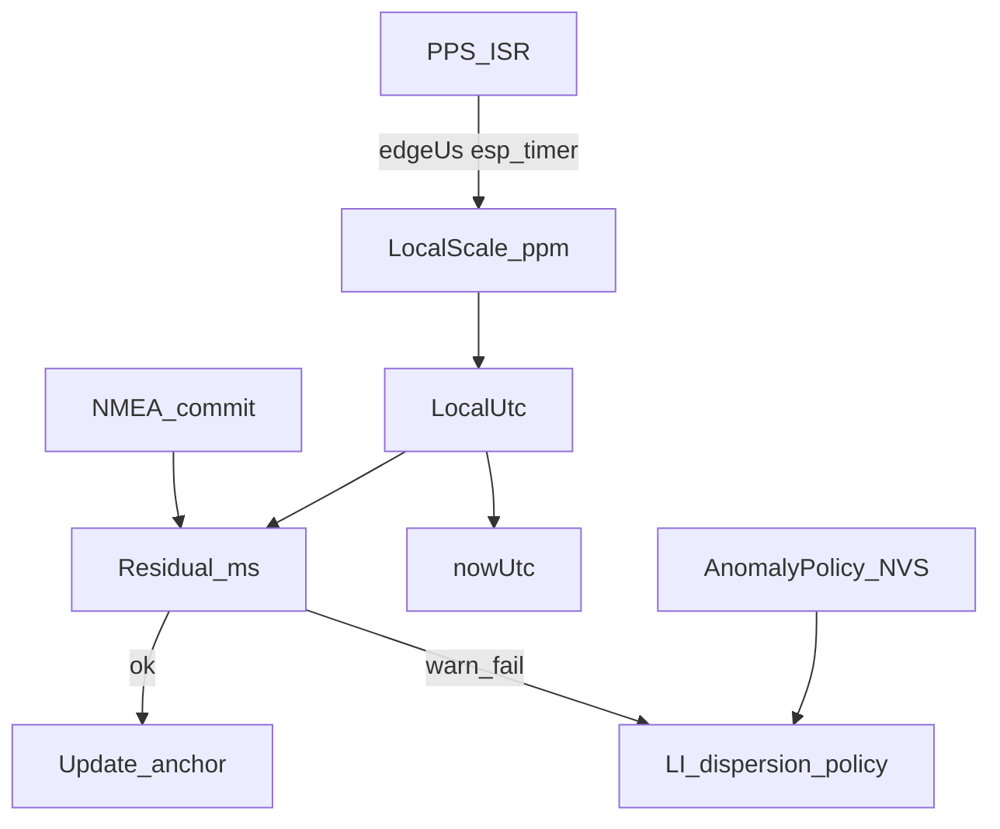
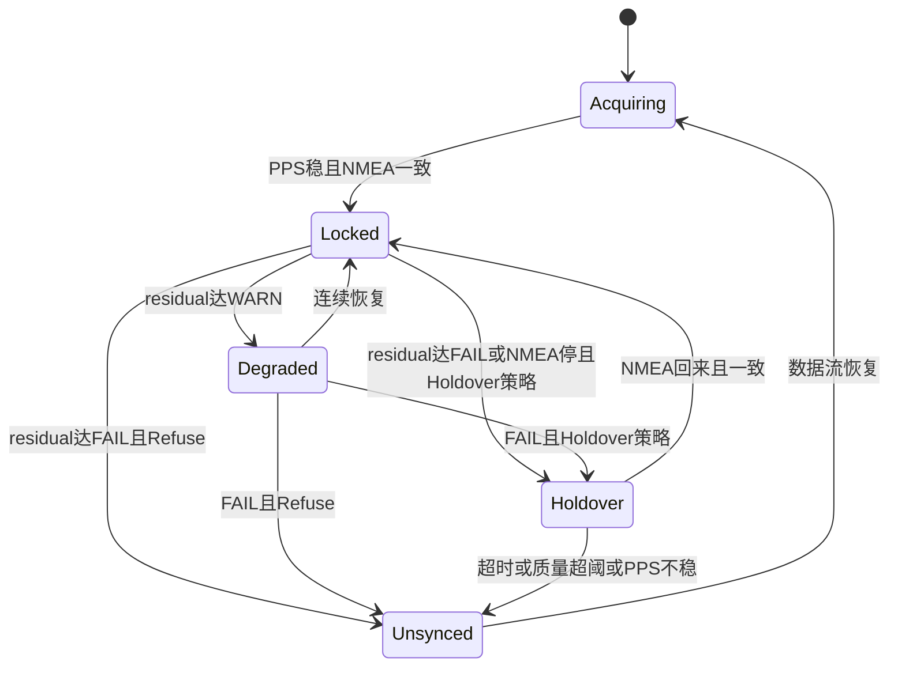

# PPS 校准本地时钟与 GPS 交叉检核

> 状态：已实现（含审核修复：Holdover 在 PPS 丢失时生效、WARN→Degraded 不重锚、策略缓存、PPS 原子拷贝、NTP LI/RefID 诚实化）  
> 日期：2026-09-11  
> 相关分支：`cursor/esp32c3-status-leds-5075`  
> 前置：FreeRTOS 三任务 + PPS-count 对齐（已落地）

## 1. 目标与非目标

### 目标

- 用 PPS 把 ESP32-C3 本地单调时钟校准成「准秒尺」
- 用校准后的本地 UTC 与 NMEA 交叉比对
- 偏差超阈 → 抬高 root dispersion；严重时 LI=3 / stratum 16
- **GPS 异常后策略由用户配置**（OLED 菜单 + Web 设置页），写入 NVS
- 逻辑只在 `task-time` 运行，不阻塞 net/ui

### 非目标（本阶段）

- 不上外部 TCXO / 完整 chrony 风格 PLL
- 不把系统 `gettimeofday` 当作对外授时源
- SoftAP 密码默认 `NTP-`+MAC 后 4 位（NVS `appw` 可覆盖）；同步时 RefID `GPSS`，未同步时 RefID `INIT`

## 2. 已落地能力（相对初版缺口）

当前实现已具备：

- `LocalClock`：PPS `esp_timer` 边沿环、ppm EMA、LocalUtc 外推
- NMEA 在 **PPS 边界** residual 交叉检核（RELOCK / WARN / FAIL）
- 状态机 ACQ / LCK / DEG / HLD / UNS；NTP 仅 LCK/DEG/HLD 授时
- PPS 或 NMEA 丢失时：Refuse → Unsynced；Holdover* → 本地守时至超时
- AnomalyPolicy + `holdoverSec` 经 OLED/Web 写入 NVS（`apol`/`ahold`）

## 3. 双时间基模型



### 3.1 LocalScale（本地秒尺）

| 项 | 设计 |
|----|------|
| 时间源 | ISR 记录 `esp_timer_get_time()`（µs，64-bit）。`millis()` 分辨率不足以估斜率 |
| 缓冲 | 最近 8～16 个 PPS 边沿 |
| 估计 | 边沿环最近 `CLK_PPM_SPAN_SEC`（默认 8）个 1s 间隔的平均误差 → `freqPpm`（再 EMA） |
| 相位锚 | 信任后的 `(utcSec0, edgeUs0)` |
| 异常 | \|间隔 − 1s\| > 5 ms 连续 3 次 → `PpsUnstable` |

ISR 保持极短：写边沿时间戳 + `ppsCount++` + `vTaskNotifyGiveFromISR`；滤波在 time 任务内完成。

### 3.2 LocalUtc（外推）

```
dt = (nowUs - edgeUs0) * (1 - ppm * 1e-6)
utc = utcSec0 + dt
```

**授时输出策略**

- **Locked / Degraded / Holdover**：每个 PPS 边沿将锚点 `utcSec` +1（相位跟 PPS 走）
- **NMEA**：交叉检核；Acquiring 时允许重锚；Locked 下仅当 \|residual\| ≥ `CLK_LOCKED_SLEW_MS` 才轻量纠相，避免秒级 NMEA 抖动抬高 std
- NMEA 提交时用 `ppsCount` lag 对齐「最后边沿对应的整秒标签」，避免 -1 s 级假 residual
- 冷启锚定要求 `ppsStable_`（连续好间隔），不在首个孤边沿上建锚
- Holdover 年龄用 `esp_timer`（与秒尺同源），不用 `millis()`
- **可选温度补偿**（NVS `tcmp` 默认关）：片上 TSENS 约 1 Hz；相对最近一次 PPS 估频时的温度做 `Δppm = k·ΔT`（默认 k=-0.50 ppm/°C，钳位 ±20 ppm）。关时行为与原先完全相同。

## 4. 交叉检核

在 NMEA **新秒**提交时（沿用 `epoch != lastCommittedSecond_`）：

**比对必须在 PPS 整秒边界**，不能用「解析完成时刻」，否则会把 100～800 ms 解析延迟算进 residual。

```
residualMs = UTC(NMEA 秒 T 的边界) - LocalUtc(at PPS_edge_T)
```

### 阈值（`include/config.h`）

| 宏 | 建议默认 | 含义 |
|----|----------|------|
| `CLK_RESIDUAL_WARN_MS` | 50 | 进入 Degraded；抬高 dispersion / UI warn |
| `CLK_RESIDUAL_FAIL_MS` | 100 | 检核失败，按 AnomalyPolicy 处理 |
| `CLK_RESIDUAL_RELOCK_MS` | 30 | 恢复 Locked 的 residual 上限 |
| `CLK_RELOCK_COUNT` | 3 | 连续通过次数 |
| `CLK_PPS_INTERVAL_MAX_ERR_US` | 5000 | PPS 间隔异常门限 |
| `CLK_PPS_UNSTABLE_COUNT` | 3 | 连续间隔异常次数 |
| `CLK_PPM_SPAN_SEC` | 8 | 估频平均间隔秒数（边沿环） |
| `CLK_TEMP_COMP_DEFAULT` | 0 | 温度补偿默认关 |
| `CLK_TEMP_COEFF_CENTI` | -50 | 默认 -0.50 ppm/°C |
| `CLK_HOLDOVER_SHORT_SEC` | 30 | 短守时默认秒数 |
| `CLK_HOLDOVER_LONG_SEC` | 300 | 长守时默认秒数 |
| `CLK_HOLDOVER_PPM_FLOOR` | 50 | 守时色散晶振误差下限 (ppm) |
| `CLK_HOLDOVER_PHI_PPM` | 15 | NTP PHI 下限 (ppm)，色散增速不低于此值 |
| `CLK_HOLDOVER_ENTRY_MS` | 100 | 进入守时额外不确定性 (ms) |
| `CLK_HOLDOVER_MAX_QUALITY_MS` | 500 | 守时质量超此值提前 Unsynced |

## 5. 状态机



| 状态 | NTP 行为 | OLED / Web |
|------|----------|------------|
| Acquiring | LI=3，stratum 16，RefID `INIT` | D5 闪；`timeValid=false` |
| Locked | LI=0，stratum 1，dispersion 小，RefID `GPSS`；Reference=末次 PPS 整秒 | D5 心跳 |
| Degraded | LI=0，stratum 1，dispersion ≥ \|residual\|，RefID `GPSS` | 网页 warn |
| Holdover | LI=0，stratum 1，dispersion 随时间增大（entry+ppm×age），RefID `GPSS`；质量超阈或超时 → Unsynced | 标明 holdover（`clock.state=HLD`） |
| Unsynced | LI=3，stratum 16，RefID `INIT` | D5 闪/灭 |

> **LI 语义**：RFC 的 LI 仅表示闰秒告警，**不用 LI=1 表示 Holdover**。守时状态靠 dispersion 与管理面（OLED/`/status`）表达。

**WARN（三种策略相同）**：仍可 stratum 1，但 dispersion 必须反映 residual。

## 6. 用户可配置：异常后策略

不做编译期二选一，作为 **运行时可配选项**，OLED 与 Web 均可修改，持久化到 NVS。

### 6.1 数据模型（`AppSettings`）

```cpp
enum class AnomalyPolicy : uint8_t {
  Refuse = 0,        // 立即拒绝授时
  HoldoverShort = 1, // 短时守时
  HoldoverLong = 2,  // 长时守时
};

AnomalyPolicy anomalyPolicy = AnomalyPolicy::Refuse;  // 默认最保守
uint16_t holdoverSec = 30;  // Refuse 时忽略；Short/Long 可覆盖预设
```

### 6.2 NVS（namespace `ntp-srv`）

| Key | 类型 | 默认 | 说明 |
|-----|------|------|------|
| `apol` | uint8 | `0` | `AnomalyPolicy` |
| `ahold` | uint16 | `30` | 守时秒数；选 Long 时 UI 可默认写入 `300` |

`task-time` **只读快照**（经 `settings` mutex 拷贝），避免持锁做授时。

### 6.3 策略语义

| 策略 | FAIL / NMEA 停滞且 PPS 仍稳时 |
|------|-------------------------------|
| **Refuse** | 立即 → Unsynced，不守时 |
| **HoldoverShort** | → Holdover，默认 30 s 后 Unsynced（NMEA 停滞 **或** PPS 丢失均可进入，靠 LocalUtc 外推） |
| **HoldoverLong** | → Holdover，默认 300 s 后 Unsynced |

切换策略时：

- **不重启**即可生效（下一轮 NMEA 提交或状态机 tick 读新快照）
- 若当前已在 Holdover：按**新策略**重算剩余时间；改成 Refuse → 立即退出 Holdover 进入 Unsynced
- 不强制重置 LocalUtc 锚点（除非进入 Unsynced/Acquiring 需要重新捕获）

### 6.4 OLED 菜单（GUI）

在现有菜单（`Timezone` / `Restart` 旁）增加：

**`Anomaly Mode`**

- 旋转切换：`Refuse` / `Hold 30s` / `Hold 5m`（短文案适配 128 宽）
- 短按：写入 NVS + `showMessage("Saved")`
- 长按：返回

首页可选缩写：`A:REF` / `A:H30` / `A:H5m`。

（进阶可选：Holdover 下再进一页调 `holdoverSec` 10～600；首版用三档预设即可。）

### 6.5 Web 设置页

扩展 `/setup`（不仅 WiFi）：

- 下拉框「GPS 异常策略」：Refuse / Holdover 30s / Holdover 5min
- `POST /save` JSON 增加 `anomalyPolicy`（及可选 `holdoverSec`）
- 状态页「WiFi 配网」链可改为「设置」，STA 下也能改策略
- `/status` JSON 增加只读字段：`anomalyPolicy`、`holdoverSec`；LocalClock 落地后另加 `clock.state`、`residualMs`、`freqPpm`

`handleSave` 持 `settingsLock` 更新 `gSettings` + `gStore.save`。

## 7. 模块挂接

| 模块 | 变更 |
|------|------|
| `settings` | `AnomalyPolicy`、`holdoverSec`；load/save `apol`/`ahold` |
| `gps_service` 或新 `local_clock` | 边沿环、ppm、LocalUtc、residual、状态机；读策略快照 |
| `ntp_server` | 按状态输出 LI/stratum/dispersion |
| `display_ui` | 菜单项 + 首页缩写 + 可选 residual |
| `web_portal` | `/setup` 表单、`/save`、`/status` 字段 |
| `config.h` | 第 4 节阈值与 holdover 默认秒数 |
| `status_leds` | Unsynced/Acquiring 与现有 D5 语义对齐；Holdover 可用慢闪区分（实现时定） |

## 8. 实现顺序

1. ~~**配置面**：settings + NVS + OLED「Anomaly Mode」+ Web 下拉~~ ✅
2. ~~**LocalScale**：`esp_timer` 边沿环 + ppm EMA + 间隔健康~~ ✅
3. ~~**LocalUtc**：锚定；Locked 时 `nowUtc` 切本地外推~~ ✅
4. ~~**交叉检核状态机** + NTP/UI 字段~~ ✅
5. ~~**按 `anomalyPolicy` 接 Holdover 分支~~ ✅
6. **验收**：烧录 + 短监测回归已通过冒烟（LCK / LI=0 / stratum 1）；**≥10 min vs 阿里云已通过两次**（2026-09-11 / 2026-09-14）。**拔 GPS 模块电源的 HoldoverLong 全链已于 2026-09-16 现场验收通过**（断电 1.5–2.5s 进 HLD / 色散爬升 / 300s 超时 UNS / 恢复无跳秒，见 [pps_pull_test_20260916.md](pps_pull_test_20260916.md)）；Refuse 变体与真·拔天线（带电失星）仍待现场补测。综合评价见 [clock_eval_two_ntp_cmp.md](clock_eval_two_ntp_cmp.md)。

冒烟（2026-09-11）：冷启约 90 s → `clk=LCK`、`residualMs=0`、`freqPpm≈-0.4`；8 轮 vs aliyun 中位差 ≈ +46 ms，无整秒跳变。
## 9. 验收标准

| 场景 | 通过条件 |
|------|----------|
| 正常锁定 | residual 中位 &lt; 20 ms；LI=0 stratum 1 |
| Refuse + 拔天线 | 迅速 Unsynced（LI=3），无假 stratum 1 守时 |
| HoldoverShort + 短暂遮挡 | 进入 Holdover，dispersion 上升，超时后 Unsynced |
| HoldoverLong | 守时窗口明显长于 Short；**300 s 超时链已于 2026-09-16 拔模块电源现场通过**（[pps_pull_test_20260916.md](pps_pull_test_20260916.md)） |
| OLED/Web 改策略 | NVS 持久化，刷新/重启后保持；不需重编译 |
| 回归 ≥10 min vs aliyun | \|diff\| &gt; 400 ms 仍为 ~0%；std 不明显恶化。**已通过**（9/11：0/60；9/14 锁定后：0/52） |
| 实时性 | ISR 仍极短；time 任务 1 ms 级轮询不变 |

## 10. 风险与注意

- 斜率与 residual 必须用 **µs 级** `esp_timer`，不能依赖 `millis`
- residual 必须在 **PPS 边界**比较，否则假告警
- 冷启动 Acquiring：宁可不授时，勿用未校准 LocalUtc
- 边沿环跨 ISR / 任务：沿用 `portMUX`
- 默认 **Refuse**：固件升级后行为最保守，符合「诚实 NTP」

## 11. 文档与代码同步（实现时）

- 更新 `AGENTS.md` Architecture：LocalClock 状态机、AnomalyPolicy、residual 阈值
- 更新 `README.md`：菜单项、Web 设置、LED/状态页对 Degraded/Holdover 的含义
- 本文件在实现里程碑处把文首「待实现」改为对应状态并补提交哈希

## 12. 与历史测试的关系

- 基线（修复前）：异常率 51.3%，整秒 stale −1 s → −3～−4 s（见 `ntp_test_report.md`）
- RTOS + PPS-count 对齐后抽测：异常率 0%，配对差中位 ~48 ms
- 本方案在「已消除整秒跳变」之上，增加 **GPS 健康可见性与可配置失效策略**，避免模块错秒时仍被客户端当作优质 stratum 1
- 2026-09-13 伺服收紧（8 s 估频、Locked 5 ms 不跟 NMEA 重锚、诚实 INIT）后，2026-09-14 Termux 10 min 干净样本 stdev 1.34 ms，并拍到 ACQ→LCK；评价见 [clock_eval_two_ntp_cmp.md](clock_eval_two_ntp_cmp.md)

## 13. 2026-09-18 伺服小优化（v1.1.6）

针对 S3 长测中「双边沿毛刺 → 清环 → 4 s ACQ」类事件：

| 改动 | 行为 |
|------|------|
| PPS 离群边沿 | \|间隔−1 s\| > 5 ms 的边沿 **不入环、不走相**，只累加 streak；吸收 `ppsCount` 以免下一拍 `delta=2` |
| Soft Unsynced | 丢锚点停授时，**保留**边沿环与 EMA ppm；`reset()` 仍硬清 |
| residual 带 | `RELOCK < \|r\| < FAIL` 统一 Degraded（原 WARN/软 FAIL 两段同动作） |
| Holdover 质量阈 | 文档明确：主限仍是 `holdoverSec`；`MAX_QUALITY_MS` 主要兜底「入口 residual 已大」 |
| NTP 组包 | `sendNormal` 读 `localClock().state()`，不再为状态打整份 `snapshot()` |
